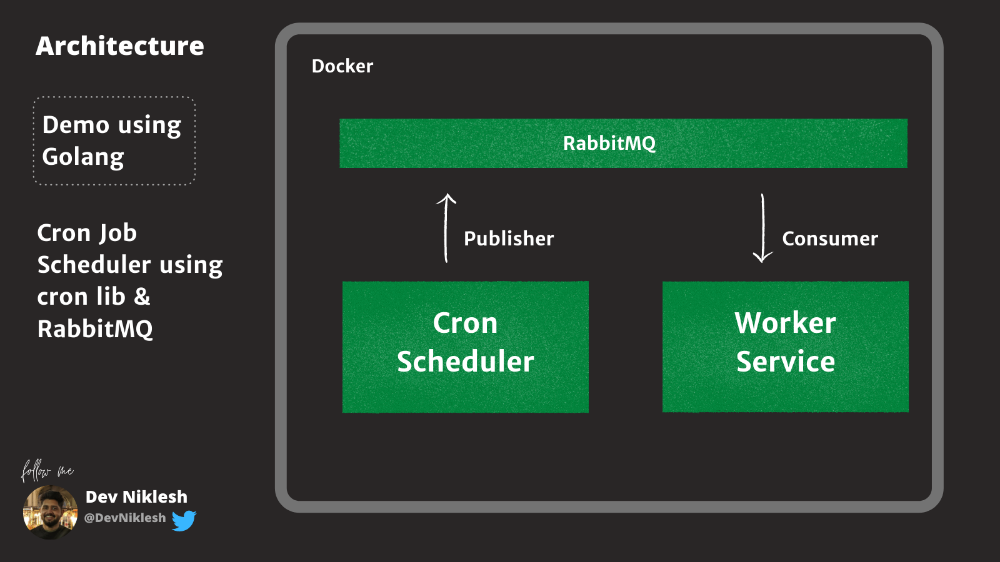

# Golang Cron Job Scheduler 
Schedules job and sends task to RabbitMQ Queues which is then consumed and the scheduled Job executed by worker



## To run app locally

```bash
git clone https://github.com/DevNiklesh/go-cron-scheduler-rabbit-mq.git
cd go-cron-scheduler-rabbit-mq
```
```bash
docker-compose up
```

You can find the messages in the logs
